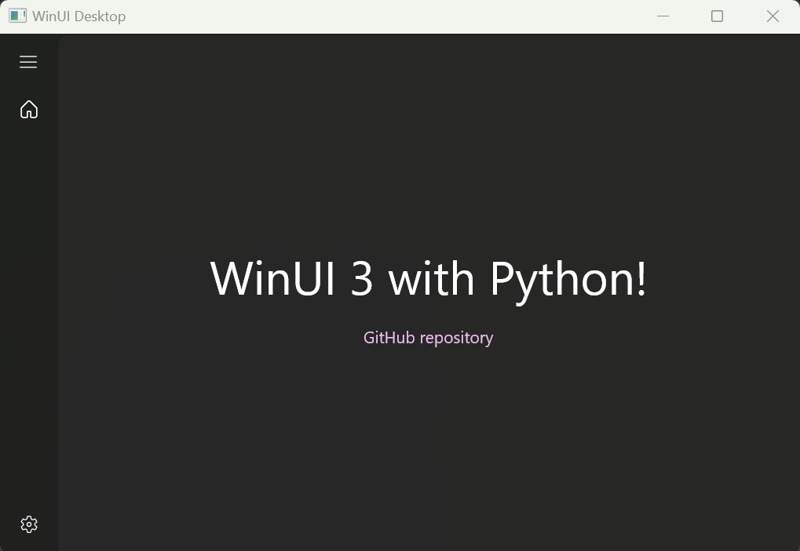

[English](README.md) | 简体中文



# WinUI 3 with Python

此存储库提供了一个使用Python的WinUI 3示例。示例程序具有以下功能：

* 加载XAML文件以布局UI组件.
* 使用Fluent Design System支持WinUI 3控件.
* Mica 应用.
* 适应高分辨率DPI显示器.

[py-win32more](https://github.com/ynkdir/py-win32more) 用于为 WinUI 3 生成 “win32more”.

## 安装教程

1. Python 3 版本
2. 下载安装 Windows App Runtime
   * [Windows App Runtime v1.5.0](https://learn.microsoft.com/en-us/windows/apps/windows-app-sdk/downloads)
3. 下载源码
```git clone https://github.com/sotanakamura/winui-python```

## 运行示例程序

第一次加载模块需要时间.

```
py winui-xaml.py
```

## 创建不带XAML文件的UI（以及处理事件）

您可以在不编写XAML文件的情况下构建自己的GUI。
此外，您可以使用自己的函数来处理事件，如下例所示。
\*此示例使用RepeatButton的示例程序。

```
py winui-click.py
```